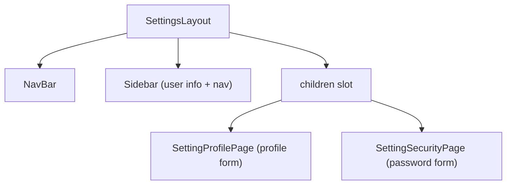

# Walkthrough — Settings Pages Refactor

## What Changed

### [NEW] SettingsLayout.tsx (`src/components/ui/SettingsLayout.tsx`)
Shared layout component extracted from `settingProfilePage.tsx`. Contains:
- `NavBar`
- Outer page wrapper (`min-h-screen bg-brown-100`)
- **Sidebar** — user avatar, name, page title, and navigation links
- Active page highlighting via `useLocation()`
- `children` slot for page-specific content

### [MODIFY] settingProfilePage.tsx (`src/pages/settings/settingProfilePage.tsx`)
Refactored to use `SettingsLayout`. Now only contains Profile-specific content (avatar upload + form).

### [MODIFY] settingSecurityPage.tsx (`src/pages/settings/settingSecurityPage.tsx`)
Implemented the Reset Password UI with three password fields (Current, New, Confirm) and a submit button, wrapped in `SettingsLayout`.

## Architecture (SoC)

## Verification
- Please check `/profile` and `/secrity` in the browser to verify both pages render correctly.
